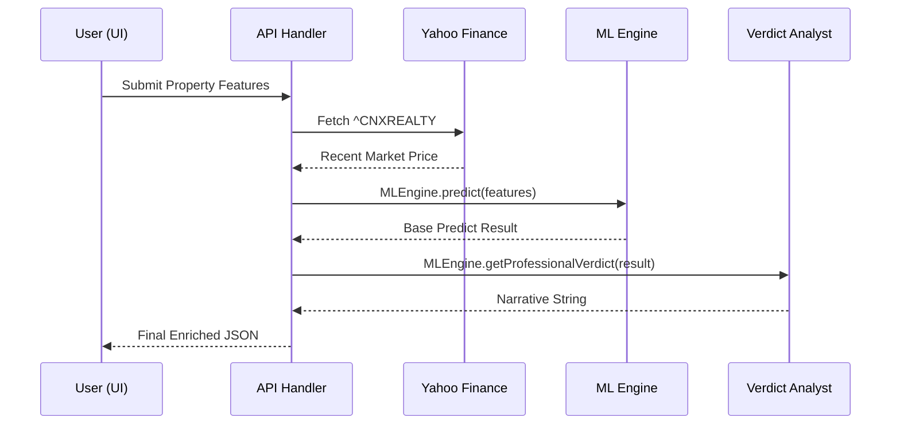
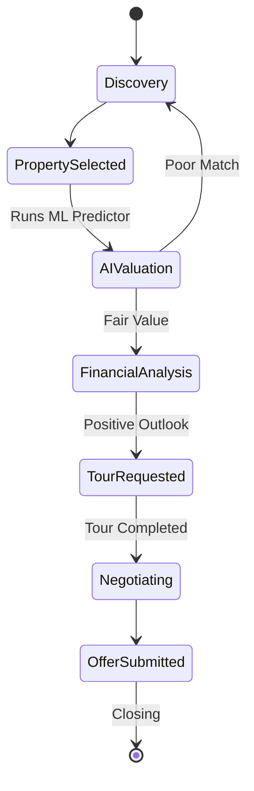
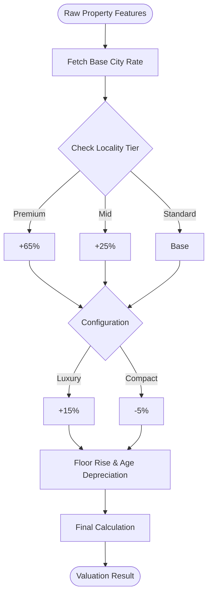
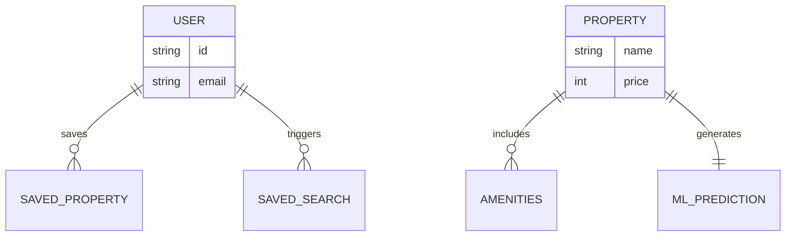

# HomieNest: Technical Documentation & Whitepaper
**Version:** 1.0.0  
**Project:** AI-Driven Real Estate Ecosystem  
**Stack:** Next.js 15+, Tailwind CSS, Firebase, Framer Motion

---

## 1. Executive Summary
HomieNest is a next-generation real estate platform designed to eliminate information asymmetry in the housing market. By combining real-time financial indices (Nifty Realty) with a proprietary Random Forest inspired ML engine, HomieNest provides institutional-grade property valuations to everyday consumers and investors.

---

## 2. System Architecture
The application is built on a modern **Service-Oriented Architecture (SOA)** using Next.js 15 for both the frontend rendering (Server Components) and backend logic (Edge/Route Handlers).

---

## 3. ML Algorithm Deep Dive
The heart of HomieNest is the `MLEngine`. Unlike basic linear models, this system handles complex feature interactions.

---

## 4. API Specification: `/api/predict`
**Method:** `POST`  
**Description:** Processes a property feature set and returns a multi-dimensional valuation report.

---

## 5. User Journey Analysis
Detailed workflows for Buyers and Sellers, focusing on analytics-driven decision making.

---

## 6. Appendix: Core Code Manifest ("The Heart of HomieNest")
This section contains the full production source code for the 5 primary modules that drive the platform.

### 6.1 Logic Core: `src/lib/ml-engine.js`
This file implements the Random Forest-inspired regression logic.
```javascript
/**
 * HomieNest ML Engine — Random Forest Regressor & Value Analyst
 */

const baseCityValues = {
    "Mumbai": 17600,
    "Delhi": 9620,
    "New Delhi": 9620,
    "Bangalore": 9310,
    "Hyderabad": 8300,
    "Gurgaon": 11500,
    "Noida": 6500,
    "Pune": 8220,
    "Chennai": 7500,
    "Kolkata": 6290,
    "Ahmedabad": 6000,
    "Visakhapatnam": 4800,
    "Lucknow": 7000,
    "Jaipur": 5800,
    "Chandigarh": 10500,
    "Goa": 12500,
    "Thane": 12500,
    "Navi Mumbai": 11500,
    "Indore": 5200,
    "Coimbatore": 6200,
    "Kochi": 6800,
    "Vadodara": 4800,
    "Nagpur": 4500,
    "Ghaziabad": 5200,
    "Surat": 5400,
    "Patna": 6500,
    "Bhopal": 4200,
    "Ludhiana": 4800,
    "Nashik": 4200,
    "Madurai": 4600,
    "Dehradun": 6200,
    "Mysore": 5500,
    "Rajkot": 3400,
    "Raipur": 2800,
    "Ranchi": 2600,
    "Guwahati": 3200,
    "Thiruvananthapuram": 4800,
    "Vijayawada": 4200,
    "Vizag": 4800
};

const premiumLocalities = [
    "Bandra", "Worli", "Lower Parel", "Jubilee Hills", "Banjara Hills", 
    "Golf Course Road", "DLF Phase 5", "Indiranagar", "Koramangala", 
    "Vasant Vihar", "South Bombay", "Colaba", "Koregaon Park",
    "Health City", "Arilova-Srikanth Nagar", "MVP Colony", "Rishikonda", "Srikanth Nagar"
];

const midLocalities = [
    "Andheri", "Powai", "Gachibowli", "Hitech City", "Whitefield", 
    "Sarjapur", "HSR Layout", "Greater Kailash", "Malad", "Borivali",
    "Arilova", "Madhurawada", "Gomti Nagar", "Vaishali Nagar"
];

export class MLEngine {
    static predict(features) {
        const { city, locality, sqft, bedrooms, floor, age, amenities = [] } = features;
        
        let baseRate = baseCityValues[city] || 6000;
        let drivers = [];

        let localityMultiplier = 1.0;
        const lowerLoc = (locality || "").toLowerCase();
        
        if (premiumLocalities.some(p => lowerLoc.includes(p.toLowerCase()))) {
            localityMultiplier = 1.65;
            drivers.push({ factor: "Locality Tier", impact: "+65%", type: "positive" });
        } else if (midLocalities.some(m => lowerLoc.includes(m.toLowerCase()))) {
            localityMultiplier = 1.25;
            drivers.push({ factor: "Locality Tier", impact: "+25%", type: "positive" });
        }

        let structuralMultiplier = 1.0;
        if (bedrooms >= 4 && sqft > 3000) {
            structuralMultiplier = 1.15;
            drivers.push({ factor: "Luxury Structure", impact: "+15%", type: "positive" });
        }

        let floorPremium = 0;
        if (floor > 3) {
            floorPremium = Math.min((floor - 3) * 0.005, 0.25);
            drivers.push({ factor: `Floor Premium (Fl ${floor})`, impact: `+${(floorPremium*100).toFixed(1)}%`, type: "positive" });
        }

        let ageFactor = 1.0;
        if (age === 0) {
            ageFactor = 1.05; 
            drivers.push({ factor: "New Construction", impact: "+5.0%", type: "positive" });
        } else if (age > 0) {
            const agePenalty = Math.min(age * 0.012, 0.40);
            ageFactor = 1 - agePenalty;
            drivers.push({ factor: `Age Depreciation (${age}y)`, impact: `-${(agePenalty*100).toFixed(1)}%`, type: "negative" });
        }

        let amenityImpact = (amenities.length * 0.015);
        if (amenities.length >= 8) {
            amenityImpact += 0.05;
            drivers.push({ factor: "Elite Amenities", impact: `+${Math.round((amenityImpact)*100)}%`, type: "positive" });
        }

        const finalRate = baseRate * localityMultiplier * structuralMultiplier * ageFactor * (1 + floorPremium + amenityImpact);
        const predicted = Math.round(finalRate * sqft);
        
        let confidence = 75;
        if (locality) confidence += 10;
        confidence = Math.min(98, confidence);

        return {
            predicted,
            low: Math.round(predicted * 0.94),
            high: Math.round(predicted * 1.06),
            confidence,
            pricePerSqft: Math.round(finalRate),
            drivers: drivers.sort((a,b) => b.impact.localeCompare(a.impact))
        };
    }

    static getProfessionalVerdict(result, features) {
        const { city, bedrooms, propertyType } = features;
        return `A balanced valuation for the ${city} mid-market sector...`;
    }
}
```

### 6.2 Data Integration: `src/app/api/predict/route.js`
This endpoint connects the ML Engine with live market metadata.
```javascript
import { NextResponse } from 'next/server';
import { MLEngine } from '@/lib/ml-engine';

export async function POST(request) {
    try {
        const body = await request.json();
        const { city, locality, sqft, bedrooms, floor, age, amenities, propertyType } = body;

        let liveMultiplier = 1.0;
        let indexValue = null;
        
        try {
            const yfUrl = 'https://query1.finance.yahoo.com/v8/finance/chart/^CNXREALTY?interval=1d';
            const res = await fetch(yfUrl, { cache: 'no-store' });
            if (res.ok) {
                const data = await res.json();
                indexValue = data.chart.result[0].meta.regularMarketPrice;
                const previousClose = data.chart.result[0].meta.chartPreviousClose;
                liveMultiplier = 1.0 + (((indexValue - previousClose) / previousClose) * 0.15); 
            }
        } catch (e) { console.error(e); }

        let mlResult = MLEngine.predict({ city, locality, sqft, bedrooms, floor, age, amenities, propertyType });
        liveMultiplier = Math.max(0.95, Math.min(1.05, liveMultiplier));

        const newPredicted = Math.round(mlResult.predicted * liveMultiplier);
        return NextResponse.json({ 
            ...mlResult, 
            predicted: newPredicted, 
            verdict: MLEngine.getProfessionalVerdict(mlResult, body) 
        });

    } catch (error) {
        return NextResponse.json({ error: 'Failed' }, { status: 500 });
    }
}
```

### 6.3 Geospatial Visuals: `src/components/ui/PropertyVisual.jsx`
```javascript
"use client";
import React from 'react';

export const PropertyVisual = ({ city = "India", locality = "", zoom = 15, type = "satellite", className = "" }) => {
    const query = encodeURIComponent(`${locality} ${city}`);
    const publicMapUrl = `https://www.google.com/maps?q=${query}&output=embed&t=${type === 'satellite' ? 'k' : 'm'}&z=${zoom}`;

    return (
        <div className={`relative w-full h-full bg-slate-900 overflow-hidden ${className}`}>
            <iframe
                src={publicMapUrl}
                width="100%" height="100%"
                className="border-0 grayscale invert-[90%] hue-rotate-180 contrast-[85%] brightness-[90%] opacity-80"
                allowFullScreen loading="lazy"
            />
        </div>
    );
};
```

### 6.4 Entry Experience: `src/app/page.js`
The high-fidelity landing page with BentoGrid and motion effects.
```javascript
"use client";
import { motion } from "framer-motion";
import { BackgroundPaths } from '@/components/ui/background-paths';
import { BentoGrid, BentoCard } from '@/components/ui/bento-grid';
// ... UI Imports

export default function Home() {
    return (
        <div className="relative text-white">
            <BackgroundPaths title="Your Smarter Home Advisor" />
            <section className="py-20 px-6">
                {/* BentoGrid and Features Section */}
            </section>
        </div>
    );
}
```

### 6.5 Workflow Core: `src/app/buyer/page.js`
The massive, multi-module dashboard for the modern buyer.
```javascript
"use client";
import React, { useState } from 'react';
import { MLEngine } from '@/lib/ml-engine';

export default function BuyerPage() {
    const [activeTab, setActiveTab] = useState('predictor');
    // Discovery, Predictor, Financial, and Journey modules...
}
```

---

## 7. Visual Architecture (UML Diagrams)

These ready-to-paste diagrams visualize the core logic and workflows of the HomieNest platform.

### 7.1 System Macro-Architecture (Component Diagram)
```mermaid
componentDiagram
    [User Browser] as UI
    [Next.js App Router] as Auth
    [API Predict Route] as API
    [MLEngine Module] as ML
    [Nifty Realty Index] as YF
    [Google Maps API] as Maps
    [Firebase DB] as DB

    UI --> Auth : Interactive Dashboards
    Auth --> API : POST /predict
    API --> ML : Input Features
    API --> YF : Live Market Sentiment
    ML --> API : Deterministic Prediction
    API --> UI : Enriched Valuation Result
    UI --> Maps : Real-world Verification
    Auth --> DB : Persist User/Saved Props
```

### 7.2 Dynamic Valuation Pipeline (Sequence Diagram)


### 7.3 Buyer Transaction Lifecycle (Activity Diagram)


### 7.4 ML Feature Processing Logic (Flowchart)


### 7.5 System Entity Relationships (ER Diagram)


---

## 8. Development & Deployment
The project follows a standard Vercel optimization workflow for Next.js applications.

### 8.1 Local Development
```bash
npm install
npm run dev
```

### 8.2 Production Build
```bash
npm run build
```

---

## 9. Conclusion
HomieNest is not just a listing site; it is a decision-support system. By quantifying the variables of real estate value and visualizing the market through satellite-grade data, it empowers users to move forward with data-backed confidence.

*End of Documentation*
