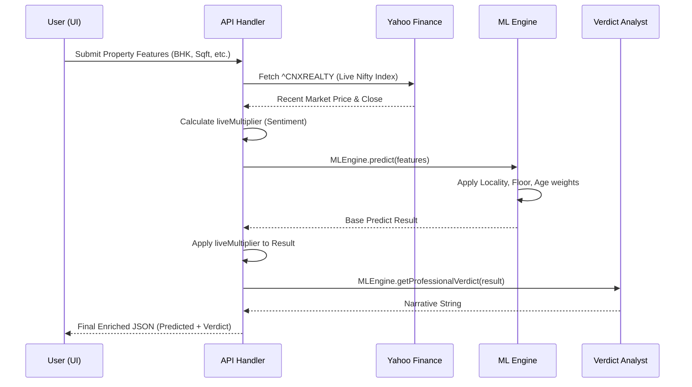
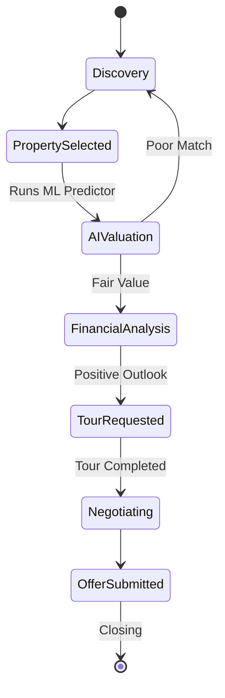
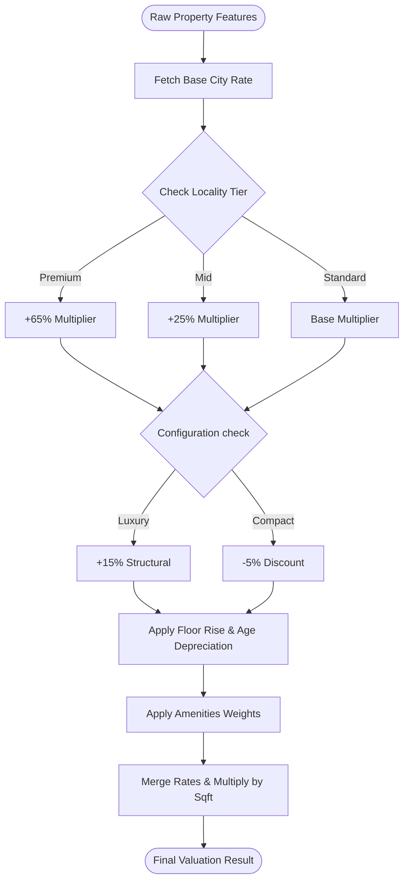
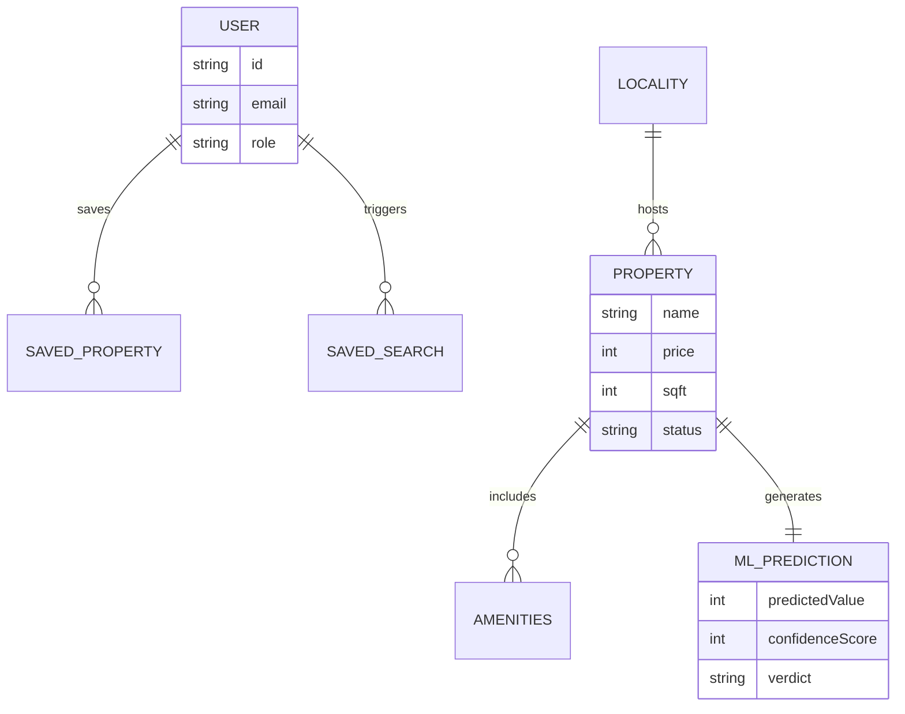

# HomieNest: Project Architecture & UML Diagrams
Visual documentation of the HomieNest Real Estate platform workflows and logic.

---

## 1. System Macro-Architecture
*Component Diagram*  
This diagram illustrates the high-level components of the HomieNest ecosystem and how they interact.

```mermaid
componentDiagram
    [User Browser] as UI
    [Next.js App Router] as Auth
    [API Predict Route] as API
    [MLEngine Module] as ML
    [Nifty Realty Index] as YF
    [Google Maps API] as Maps
    [Firebase DB] as DB

    UI --> Auth : Interactive Dashboards
    Auth --> API : POST /predict
    API --> ML : Input Features
    API --> YF : Live Market Sentiment
    ML --> API : Deterministic Prediction
    API --> UI : Enriched Valuation Result
    UI --> Maps : Real-world Verification
    Auth --> DB : Persist User/Saved Props
```

---

## 2. Dynamic Valuation Pipeline
*Sequence Diagram*  
Trace of a single price prediction request.



---

## 3. Buyer Transaction Lifecycle
*Activity Diagram*  
The user journey from discovery to offer.



---

## 4. ML Feature Processing Logic
*Logic Flow Diagram*  
How the `MLEngine` transforms raw inputs into a priced asset.



---

## 5. System Entity Relationships
*ER Diagram*  
Data relationships between core entities.



---

*Note: These diagrams are generated using Mermaid.js syntax and are compatible with GitHub and most Markdown editors.*
